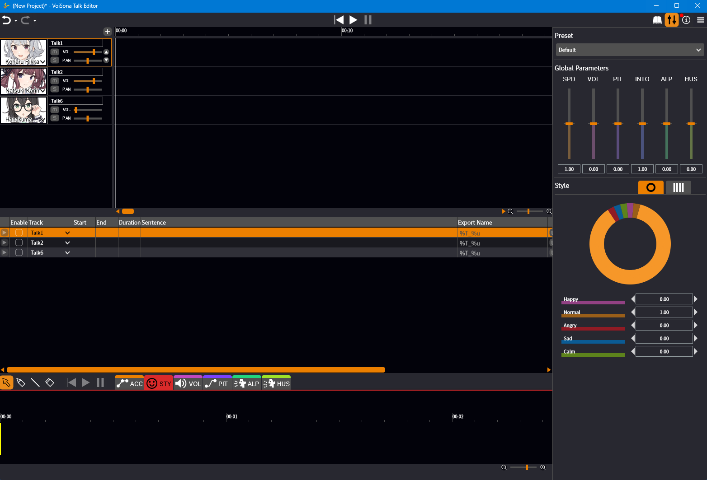
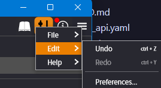
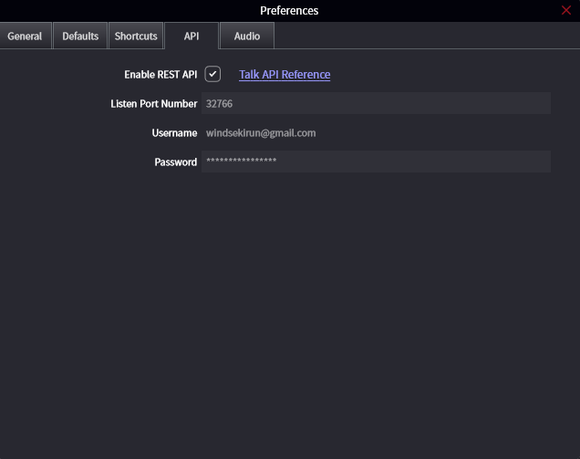

# Connecting with Voisona Talk

|     | Guide                                        | Picture              |
| --- | -------------------------------------------- | -------------------- |
| 1   | Install Voisona, Voice Libraries             |  |
| 2   | Click Menu > Edit > Preference               |  |
| 3   | Enter Password and Check 'Enable REST API'   |  |
| 4   | Input your username, password into .env file |                      |
